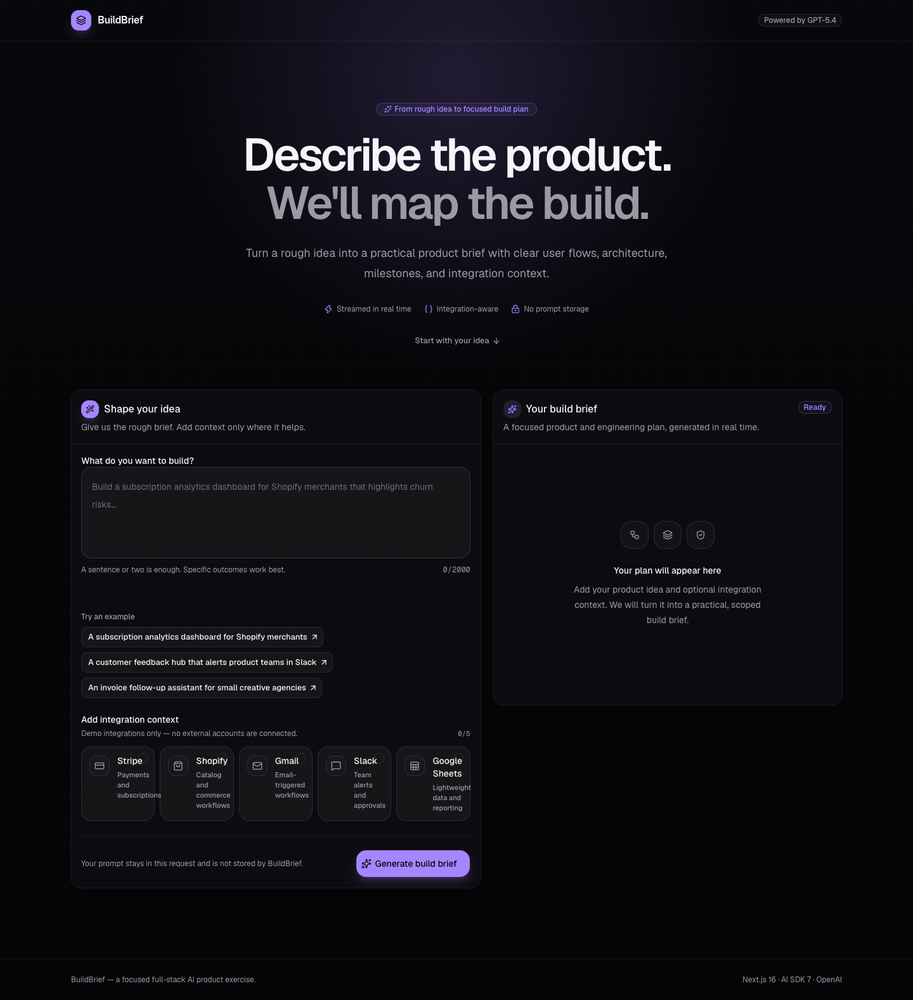
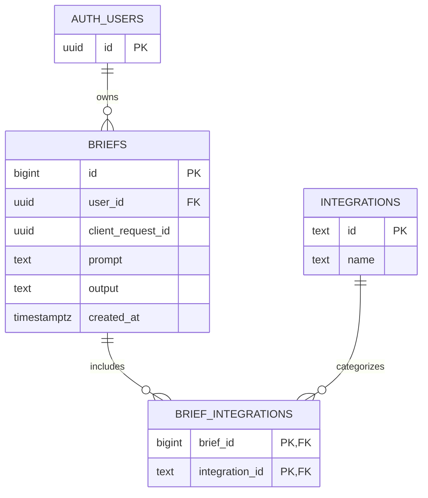

# BuildBrief

BuildBrief turns a rough product idea into a concise, integration-aware product and engineering plan. It is a focused full-stack AI exercise built for the Stunning Full-Stack Vibe Coder candidate task.

**[Live application](https://stunning-builder-task.vercel.app)** ·
**[GitHub repository](https://github.com/Ahmedsultan09/stunning-builder-task)**



## What it does

- Accepts a product prompt between 10 and 2,000 characters.
- Adds optional context for Stripe, Shopify, Gmail, Slack, and Google Sheets.
- Constructs the system prompt on the server so selected integrations reliably affect the result.
- Streams a concise three-part response shaped by the user’s idea and selected integration context.
- Supports cancellation, retry, regeneration, safe Markdown rendering, and copy-to-clipboard.
- Offers optional GitHub sign-in, automatic saving, private history, and deletion.
- Includes responsive, keyboard-accessible idle, loading, success, validation, timeout, and provider-error states.

## Architecture

```text
Browser form
    ├─ POST /api/generate → AI SDK 7 → Groq → GPT-OSS 120B
    │                                      │
    │                                      ▼
    │                               UTF-8 text stream
    │
    └─ completed + signed in → POST /api/briefs
                                  │
                                  ▼
                    Supabase Auth + Postgres + RLS
```

The page shell, authenticated navigation, and history reads are React Server Components. The interactive builder remains a Client Component. Integrations are still prompt context only; GitHub OAuth authenticates users for private brief persistence and does not connect any integration account.

## Stack

- Next.js 16.3 App Router and React 19.2
- TypeScript in strict mode
- Tailwind CSS 4 and shadcn/UI with Radix primitives
- Vercel AI SDK 7 and the direct Groq provider
- Supabase Auth, Postgres, Row Level Security, and `@supabase/ssr`
- Zod 4 request validation
- Vitest, Testing Library, and Playwright

AI SDK 7 requires Node.js 22 or newer. The repository includes `.nvmrc` and an `engines` declaration so local and hosted runtimes stay aligned.

## Run locally

```bash
nvm use
npm install
cp .env.example .env.local
```

Add a free Groq API key to `.env.local`:

```env
GROQ_API_KEY=your_groq_api_key
NEXT_PUBLIC_SUPABASE_URL=https://your-project-ref.supabase.co
NEXT_PUBLIC_SUPABASE_PUBLISHABLE_KEY=sb_publishable_your_key
```

The Groq key is server-only. Supabase's publishable key is intentionally safe
to expose because every public table has explicit grants and RLS policies.
There is no service-role or secret Supabase key in the application.

Then start the app:

```bash
npm run dev
```

Open [http://localhost:3000](http://localhost:3000).

## Commands

```bash
npm run dev        # local development
npm run lint       # ESLint with zero warnings allowed
npm run typecheck  # strict TypeScript check
npm test           # unit, route, and component tests
npm run test:e2e   # Playwright browser smoke test
npm run build      # production build
npm run check      # lint + typecheck + tests + build
```

The Playwright test intercepts the AI endpoint. This keeps automated runs deterministic and free from inference cost. A real Groq request should still be smoke-tested manually before submission.

Additional responsive preview: [mobile layout](./public/buildbrief-mobile.png).

## API

`POST /api/generate`

```json
{
  "prompt": "Build a subscription dashboard for small agencies",
  "integrations": ["stripe", "slack"]
}
```

The endpoint returns a UTF-8 text stream. Invalid input returns `400`; missing or unavailable model access returns `502`; a timeout before the response starts returns `504`. Input, output, and request duration are bounded to control individual request cost.

`POST /api/briefs`

```json
{
  "requestId": "3f753e46-bb8a-4d5f-841a-283da7a6760b",
  "prompt": "Build a subscription dashboard for small agencies",
  "integrations": ["stripe", "slack"],
  "output": "## Product idea\n..."
}
```

This endpoint requires a verified Supabase session. It calls one
`security invoker` Postgres function that atomically and idempotently stores
the brief and its integration relationships. Invalid payloads return `400`,
missing sessions return `401`, and persistence failures return `503` without
exposing database details.

## Data model and RLS



- `briefs` can only be selected, inserted, or deleted by their owner.
- `brief_integrations` can only be read or inserted through an owned brief.
- `integrations` is readable but immutable for authenticated application users.
- Anonymous requests receive no table privileges. Anonymous AI generation does not touch Supabase.
- Foreign keys and RLS lookup columns are indexed, and deleting a brief cascades to its relationship rows.

The schema is versioned in `supabase/migrations`. To reproduce it, link a
Supabase project and apply the migration with the Supabase CLI.

## GitHub OAuth setup

1. Create an OAuth App in GitHub under **Settings → Developer settings → OAuth Apps**.
2. Use the production origin as the Homepage URL.
3. Use `https://<project-ref>.supabase.co/auth/v1/callback` as the Authorization callback URL.
4. Enable GitHub in Supabase Auth and add the client ID and secret there.
5. Set the Supabase Site URL to the production origin and allow both local and production `/auth/callback` URLs.

The local Supabase config references
`SUPABASE_AUTH_EXTERNAL_GITHUB_CLIENT_ID` and
`SUPABASE_AUTH_EXTERNAL_GITHUB_CLIENT_SECRET`; neither credential is committed.

## Provider choice

The original architecture targeted Vercel AI Gateway with Claude Sonnet 5.
Gateway inference was blocked by account-level billing verification, and the
available OpenAI Platform organization had no API credit. The live deployment
therefore uses Groq's free tier with OpenAI GPT-OSS 120B. This preserves a real
streamed model response, AI SDK 7 provider abstraction, and all server-side
safety boundaries without adding a payment requirement. The free tier is
appropriate for a candidate-task demo, not an SLA-backed production workload.

## Design and engineering rationale

- The visual direction uses dark neutral surfaces, one violet accent, Geist typography, restrained ambient lighting, and a focused two-step workspace.
- Integration selection uses real buttons with `aria-pressed`, so the interaction works with keyboard and assistive technology.
- User input is sent as a user message, never interpolated into the system role. Only trusted integration metadata is added to the system prompt.
- The route reads the first model chunk before sending response headers. Provider setup failures can therefore return a useful HTTP status instead of a broken `200` stream.
- Model Markdown is rendered without raw HTML.
- Anonymous prompts are never persisted. Completed briefs are saved only for signed-in users and remain private through RLS.

For prioritization and production tradeoffs, see [DECISIONS.md](./DECISIONS.md). For the recent-technology assessment, see [TECH.md](./TECH.md).

Loom video: https://www.loom.com/share/790996d669dd439299cfaa1b12fb772a
